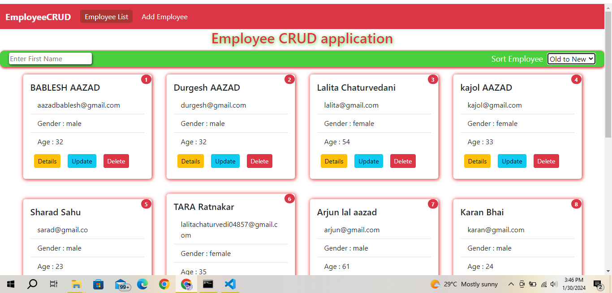
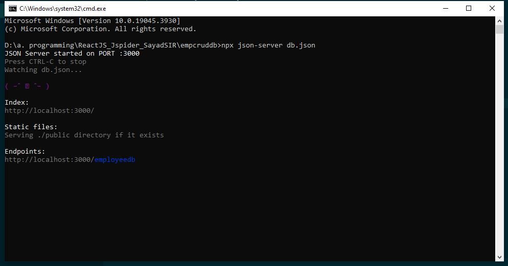

# React + Vite

This template provides a minimal setup to get React working in Vite with HMR and some ESLint rules.

Currently, two official plugins are available:

- [@vitejs/plugin-react](https://github.com/vitejs/vite-plugin-react/blob/main/packages/plugin-react/README.md) uses [Babel](https://babeljs.io/) for Fast Refresh
- [@vitejs/plugin-react-swc](https://github.com/vitejs/vite-plugin-react-swc) uses [SWC](https://swc.rs/) for Fast Refresh

About Project : It is a simple employee management system using reacjs, react-router-dom, top-bar-scroll, react modal, json-server etc. performing CRUD operations

This project is make using react + vite and using json-server api for storing data 
HOW to use : 
1. install json-server
2. download packed and run in command prompt : "npm i"  it is insall all required packages
3. first start your json server then start your react+vite project

   

   <h2>Home page : delete employee, see detail about emplyee, sorting according requirement </h2>
     
      
    <h2> Add Employee </h2>
     
       
    <h2> Update Employee </h2>
     
      
    <h2> JSON-server </h2>
     
   
