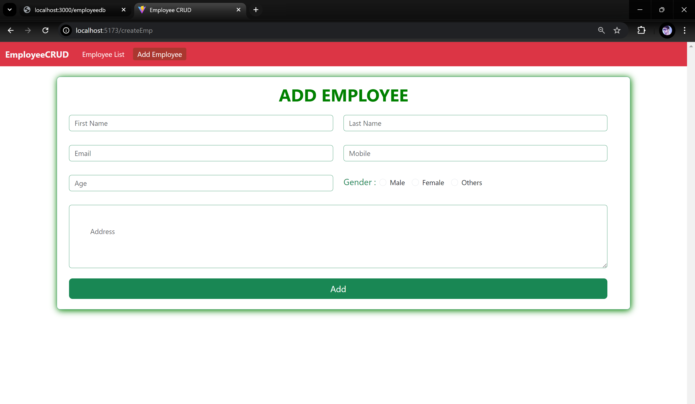

## 🚗👨‍🎓🏠 Employee CRUD Application [BableshAAzad.com](https://www.bableshaazad.com)
This application allows you to perform basic `CRUD operations`, as well as filter, sort, and search employee data. It is built using `ReactJS+Vite` and stores data using a `Dummy JSON server`.

---

**🏠 Features:**
- Perform basic CRUD operations.
- Sort employees based on `new to old`, `old to new`, `a to z`, `z to a`.
- Search employees by name.

---

**🧑‍💻 Technologies Used:**

`ReactJS+Vite` `react-router-dom` `react-top-loading-bar` `Bootstrap 5` `JavaScript` `HTML` `CSS`

---

**💻 How to Use the Source Code:🧑‍💻**
1. Download the `main` branch as a zip file.
2. Import the project into your IDE and ensure Node.js is installed.
3. In the root directory, open a command prompt and run: `npm install`
4. To store data, create a separate folder where you want to keep your data. Open this new folder in the command prompt and enter `npm install json-server`. For more information, visit [JSON-Server](https://www.npmjs.com/package/json-server).
5. Inside your database folder, create a file named `db.json`.
6. Add the following content to your `db.json` file:
````json
   {
     "employeedb": []
   }

````
7. In the root directory of your database folder, open a command prompt and enter: `npx json-server db.json`.
8. Your dummy database server is now ready to use. See the image below for the server running view 👇.
9. Now, your ReactJS+Vite project is ready to use. In the root folder of your ReactJS+Vite application, open a command prompt and type: `npm run dev`
---

#### 📝 Examples UI

#### 🏠 JSON server running view 👲
- Json Server endpoint : [http://localhost:3000/employeedb](http://localhost:3000/employeedb)
<p align="center">
  
</p>

**Response:**
  ```json
{
  "employeedb": [
    {
      "id": "e0ca",
      "firstName": "BABLESH",
      "lastName": "AAZAD",
      "email": "aazadbablesh@gmail.com",
      "mobile": "8319316077",
      "age": "28",
      "address": "Benglore India",
      "gender": "male"
    },
    {
      "id": "123d",
      "firstName": "Durgesh",
      "lastName": "AAZAD",
      "email": "durgesh@gmail.com",
      "mobile": "7898300817",
      "age": "32",
      "address": "Tundri Chhattisgarh India",
      "gender": "male"
    }
  ]
}
  ```
---

#### 🏠💻 Home Page 👲

<p align="center">
  
</p>

---

#### 🔍 Search Employees 👨‍🎓

<p align="center">
  
</p>

---

#### ✂️ Sort Employees 🔍

<p align="center">
  
</p>

---

#### ➕ Add Employee 👲👜

<p align="center">
  
</p>

---

#### ✒️📝 Update Employee 👩‍🦳👨‍🦳

<p align="center">
  
</p>